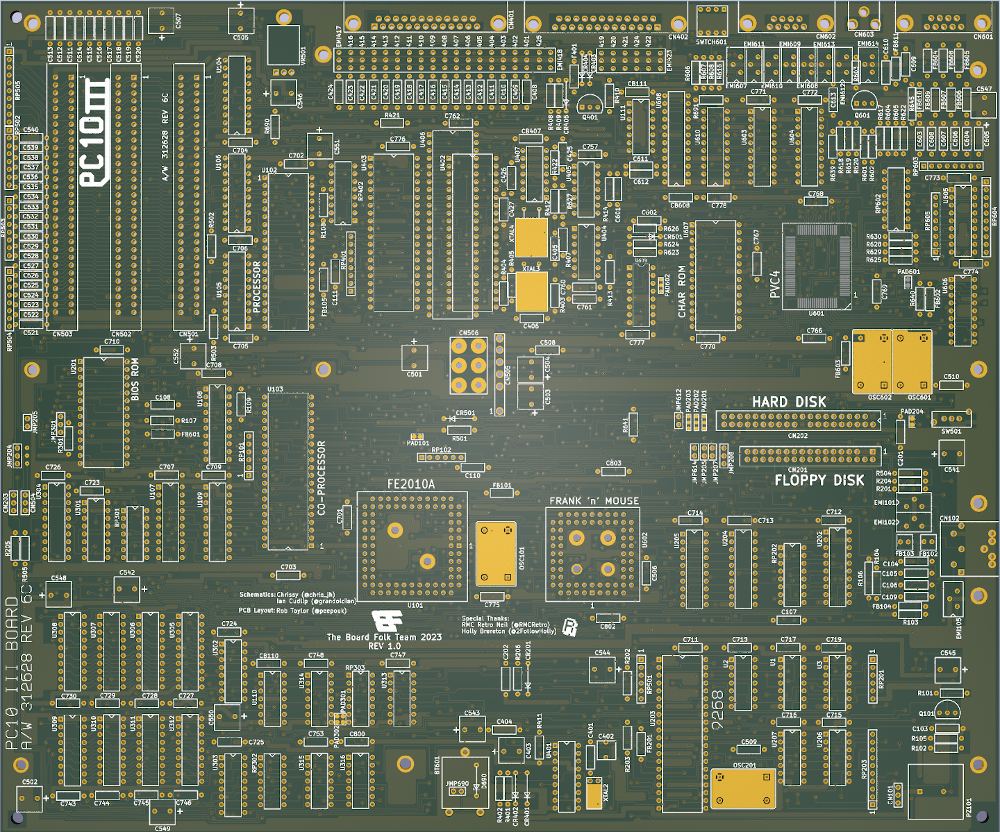

# Commodore-PC10-III PCB Reproduction 312628-REV-6C

This repository contains a recreation of the main board PCB for Commodore PC10-III 312628 Revision 6c.
This recreation is based on the available schematics for the
Commodore PC10-III 5.7a (No 6c schematics available) and reverse engineering using scanned images of the original 6c
board's copper layers, so should be a reasonably accurate reproduction.

The original board had some bodge wires and resistors. This Reproduction has them built in.

## PCB Production

Minimum track widths, clearances and via sizes are within the standard
offering of modern PCB fabricators. Gerber files are provided to the 
specification of JLCPCB, but should also work with PCBWay.

The design is verified to work as a 2-layer PCB.

ENIG is recommended, but HASL will work also.

## Bill of Materials

Most parts are marked on the board and it is expected that these will be reused
from a donor board. It is completely possible that your particular board uses
different (but compatible) parts so it's advisable to take photos before starting.

[**Interactive BOM**][IBOM6c]

## Thanks

  * Rob Taylor ([@PeepoUK](https://github.com/PeepoUK)) for doing most of
    the PCB layout
  * Ian Cudlip (@grandoldian) Schematics
  * Chrissy (@chris-jh) Schematics
  * RMC Retro (@RMCRetro) provided 6c PCB
&nbsp;
  * The rest of the Board Folk Team for their support and general
    coolness.\
&nbsp;

## Legal

As the product of this project is a replica of a proprietary product, the
the author makes no claim of copyright to the schematics nor PCB layouts and
releases these into the public domain, solely for the purposes of study and
historical preservation.

You are free to produce PCBs based on this project's designs at your own risk
and without limitation, for your own use or for sale and/or repair at a
reasonable price. Attribution is appreciated. The authors are not obliged to
provide support of any kind.

Under no circumstances will the authors be held responsible or liable in any
way for losses, damages or costs resulting from the use of the information
and/or resources of this project.

The resources are provided "as-is" without warranty of any kind, either
expressed or implied, including, but not limited to, the implied warranties

[IBOM6c]: http://htmlpreview.github.io/?https://raw.githubusercontent.com/Board-Folk/Commodore-PC10-III-Reproduction/main/312628-REV-6c/bom/Interactive_BOM.html
